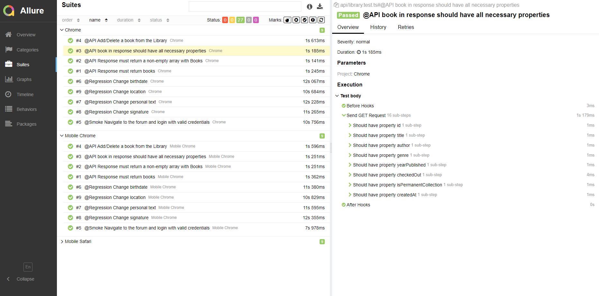

# Getting started

Playc0de is a framework based on Microsoft Playwright that will allow you to automate tests for modern web applications. From Web, Mobile, UI, API, Visual Testing to Performance and Accessibility audits.

Let's discover **Playc0de in less than 5 minutes**.

## Prerequisites

Get started by installing the required tools to run the Framework:

- [Node.js](https://nodejs.org/en) version 16.14 or above
- [Java]( https://www.java.com/es/download/) version 8 or above

We also recommend installing: 

- [Visual Studio Code](https://code.visualstudio.com)
- [GitHub Copilot](https://marketplace.visualstudio.com/items?itemName=GitHub.copilot)
- [Error Lens](https://marketplace.visualstudio.com/items?itemName=usernamehw.errorlens)

## Installation

Now we can get started by creating a new directory for our project:
```bash
mkdir playc0de-project
cd playc0de-project
```

Clone the [GitHub](https://github.com/underc0delabs/Playc0de) repository in your project folder.

```bash
git clone https://github.com/underc0delabs/Playc0de.git
```

Proceed to install packages and dependencies:
```bash
npm install
```

If you're using Playwright for the first time you should download all browsers:
```bash
npx playwright install
```

Now we verify that everything is good to go by running the following command:
```bash
ENV=qa npx playwright test
```

## Configuration

1. Review and adjust your desired configuration: `./playwright.config.ts`
2. Adjust the test data for each environment: `./utils/testConfig.ts`
3. If your project has more than two environments, add them in: `/src/core/dataHandler.ts`

### Commands

1. Run all the test
```bash
ENV=qa npm run test
```

2. To debug or explore test, run in **watch mode:**
```bash
ENV=qa npm run test:ui
```

3. Run test with specific **@tag**
```bash
ENV=qa npm playwright test --grep "@tag"
```

4. Generate Allure report after test run:
```bash
npm run report
```

5. Record new test script
```bash
npm run record
```

6. Open trace viewer to debug failed test. Please note that artifact **trace.zip** normally found at: `./reports/artifacts`
```bash
npm run trace
```

7. Run test on a single browser (Chrome by default):
```bash
ENV=qa npm run test:browser
```

8. For additional commands, you can check **Playwright Docs:** https://playwright.dev/docs/running-tests

9. For custom commands, you should add them in `./package.json`

## Reports

- HTML report will be generated by default
- Allure report can be generated manually after each run with the corresponding command
- Screenshots, videos and trace files will be generated in `./reports/artifacts`
- Evidence will be generated only for failed test. You can change this setting in `playwright.config.ts`


